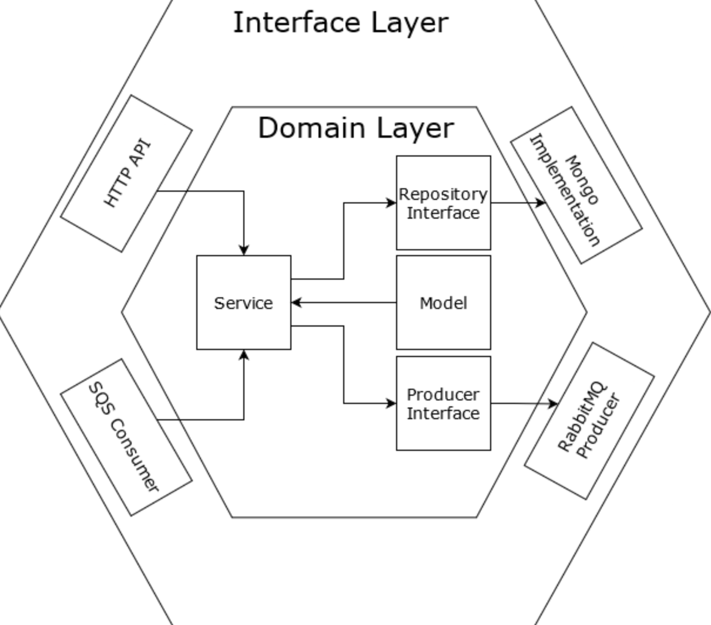
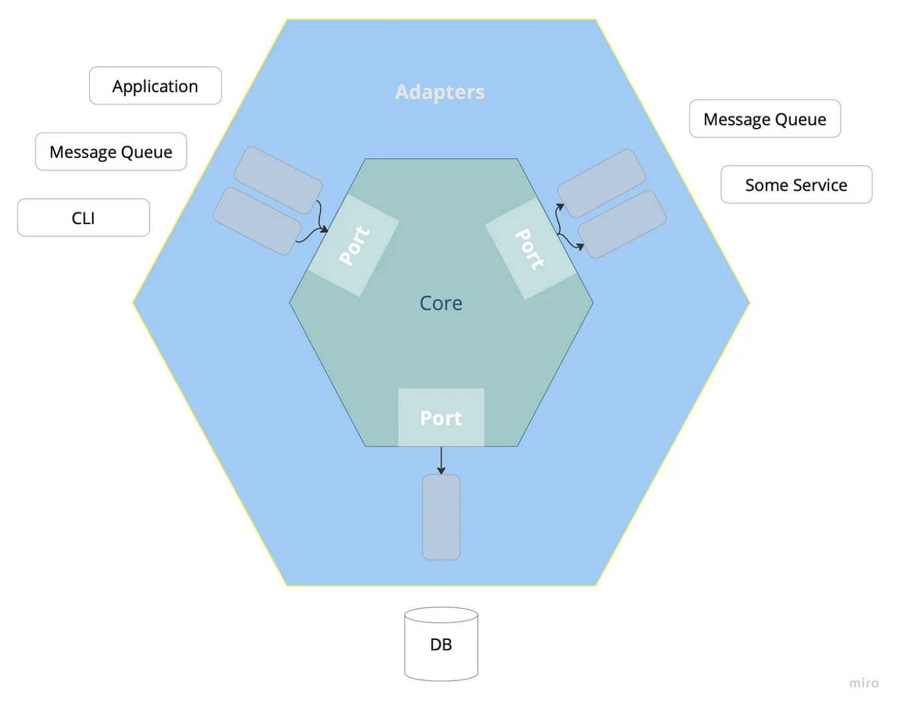
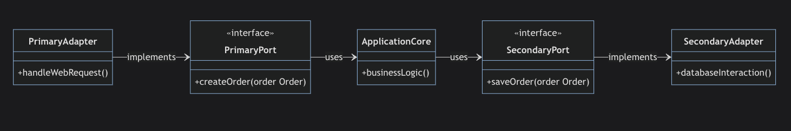
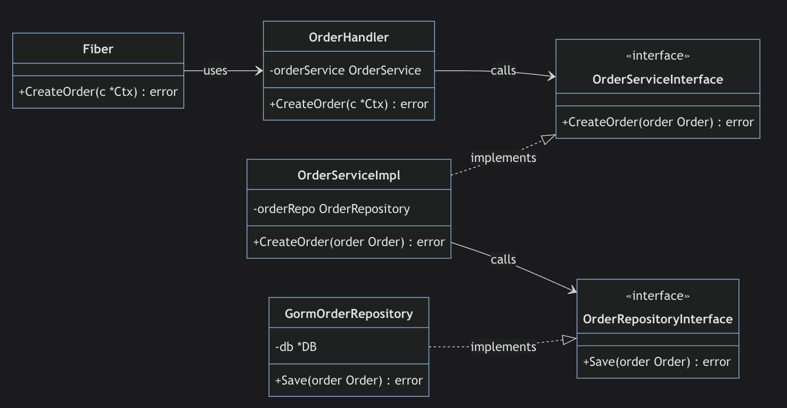

# Hexogonal Arch

สาเหตุที่เราควรต้องทำสิ่งนี้เพื่อให้

1. Package structure เป็นระเบียบมากขึ้น สามารถแยกส่วนของ package ได้เป็นระบบมากขึ้น
2. ใช้พลังของ interfaces ของ Go ได้เต็มประสิทธิภาพมากขึ้น ทำให้สามารถแยกส่วน components (decoupling components) ออกจากกันได้ 3. 3.3.3 ทำให้ระบบสามารถจัดการแต่ละส่วนของ code ออกจากกันได้ ทำให้เวลาแก้ไขแต่ละส่วนสามารถทำได้ง่ายขึ้น
Error Handling ได้ดียิ่งขึ้น ทำให้การจัดการ Error เป็นไปในทิศทางเดียวกันทั้ง code ได้ และสามารถ debug ได้ง่ายขึ้น
Testability สามารถเขียน Testing ได้ง่ายขึ้น

และสิ่งที่สำคัญที่สุดเลยคือ

Collaboration ทำให้เราสามารถทำงานเป็นทีมกันได้เป็นระบบยิ่งขึ้น เนื่องจากภาษา Go นั้นเป็นภาษาที่ค่อนข้าง "อิสระ" ในการเขียนสูงมาก อาจจะส่งผลให้แต่ละคนเขียน code style ไม่เหมือนกัน = การมี Architecture กำกับจะทำให้ code เป็นไปในทิศทางเดียวกันได้

# Hexogonal คือ
Hexagonal architecture ถูกคิดค้นโดย Alistair Cockburn เมื่อปี 2005 โดยเป็น 1 ใน Code architecture pattern ที่เป็นที่นิยมของ Go ที่สร้างอยู่บน 2 pattern ใหญ่ๆคือ Adaptor Pattern และ Dependency Injection โดย

    - Hexagonal จะนำเสนอส่วนที่เป็น "business logic" ขึ้นมาโดยไม่สนใจว่า ส่วนที่มาเชื่อมต่อจะเป็นส่วนไหน ขอแค่ทำตาม spec ของ business logic = สามารถใช้งานได้แล้ว
    - เป็นการแยกส่วนกันระหว่าง inside part (business logic, domain layer) และ outside part (ส่วนเชื่อมต่อกับภายนอกเช่น UI, database, external service - interface layer)

    # https://www.tomkdickinson.co.uk/hexagonal-architecture-with-go-and-google-wire-e4344dd24b94

# โดยองค์ประกอบใหญ่ๆของ Hexagonal Architecture จะประกอบด้วยของ 3 อย่างใหญ่ๆคือ

    - Ports ส่วน interfaces ที่บอกว่า application สามารถเชื่อมต่อมายัง business logic ได้ยังไง หรือ สามารถเข้าถึง resource ภายนอกได้ยังไง
    - Adapters ส่วนที่จะมาเชื่อมต่อกับ Port เป็นเหมือน "สะพาน" ระหว่าง Resource จริง กับ business logic (เช่น เป็นคนคุยกับ database, web service เป็นต้น)
    - Domain-centric ส่วนตรงกลางของ Business logic เป็นเหมือนศูนย์กลางของการคำนวน

# เจาะลึกแต่ละส่วน
ในส่วนนี้เราจะเพิ่มเติมความเข้าใจแต่ละส่วนผ่าน class diagram กันก่อน ก่อนที่เราจะไปลงมือ code จริงกัน

1. Port
Port คือ concept ของการแยกส่วนระหว่าง application's core logic (the domain) ออกจากส่วนที่ "สามารถกระทำได้จากภายนอก (external)" เช่น user interface, database

Port ทำหน้านี้เป็นตัวแทนของการสื่อสารแกนกลาง (Business logic) และจะทำหน้าที่ส่งต่อไปยัง business logic
ในทาง programming Port จะถูกเรียกว่า "interface" หมายถึงส่วนที่ใช้สำหรับแลกเปลี่ยนข้อมูล
โดยปกติ Port จะมี 2 ประเภท

    Primary or Driving Ports เป็น interfaces ที่ถูกใช้งานจากภายนอก เช่น Web API (ที่ client application เรียกใช้)
Secondary or Driven Ports เป็น interface ที่ใช้สำหรับจัดการกับ Resource ภายนอก ซึ่งปกติจะเกี่ยวกับการจัดการ external service หรือ database
ยกตัวอย่างสำหรับ 2 เคสนี้ สมมุติว่าเราต้องทำ API สำหรับสร้าง Order ขึ้นมา โดยเราจะแยกออกเป็น 2 ส่วนคือ

    - Primary Ports = ส่วน Web API ที่ใช้สำหรับรับข้อมูล order จาก user (จาก class diagram ด้านล่างคือ OrderServiceInterface)
    - Secondary Ports = ส่วน interface ที่เชื่อมต่อไปยัง database เพื่อบันทึกข้อมูล order (จาก class diagram ด้านล่างคือ OrderRepositoryInterface)

จาก Diagram ด้านบน

    -Primary Ports (ส่วน API สำหรับ create order)
มี OrderServiceInterface เป็น interface สำหรับการ implement primary port ซึ่งเป็นการกำหนดว่าการสร้าง order ต้องส่งอะไรมาบ้าง
    - Secondary Ports (ส่วนสำหรับการคุยกับ database)
มี OrderRepositoryInterface เป็น interface สำหรับการ implement secondard port ว่า ถ้าจะต้องสร้าง data เข้มาต้องส่งอะไรมาบ้าง

2. Adapter
Adapter คือ component ที่เชื่อมต่อระหว่าง application core logic (ผ่าน Port) กับส่วนของ External Resource

adapter เป็นส่วนสำคัญที่ทำหน้าที่เป็นเหมือน "สะพาน" เชื่อมต่อระหว่าง application และ external component
เป็นคนคอยแปลง request และส่ง data ให้
โดยปกติ Adapter มี 2 ประเภทเช่นกัน

Primary or Driving Adapters adapter สำหรับการ handle (และทำการแปลง) input ที่เข้ามาใน application เพื่อเตรียมสำหรับใช้งานใน application core logic เช่น Web Controller, CLI (Command Line Interface)
Secondary or Driven Adapters adapter สำหรับการพูดคุยกับภายนอก เช่น database adapter สำหรับการแปลงข้อมูลเป็น SQL query เพื่อใช้สำหรับเรียกไปยัง database ปลายทาง
โดยทั่วไปแล้ว การ implement adapter จะ implement ตาม port interface ที่ถูกกำหนดจาก application's core เพื่อเป็นการแยกส่วนกันระหว่าง application internal logic และ การพูดคุยกับภายนอกออกมา

อธิบายเพิ่มเติม จากตัวอย่าง create order ด้านบน

    - Primary or Driving Adapters
มี OrderHandler ทำหน้าที่เป็น HTTP handler ที่รับข้อมูลจาก web server โดยไอเดียคือ OrderHandler จะรับข้อมูลจาก HTTP request มาเพื่อใช้สำหรับการสร้าง order โดยทำการดึง data ออกจาก request และทำการแปลงข้อมูลไปใน format ที่ core application สามารถใช้งานต่อได้
    - Secondary or Driven Adapters
มี GormOrderRepository ทำหน้าที่เป็น database adapter โดยมีหน้าที่นำข้อมูล order จาก application's core logic และทำการแปลงเป็นคำสั่งสำหรับการส่งเข้า Database (เช่น แปลงเป็นคำสั่ง SQL)

3. Application Core (Domain-centric)
Application core (หรือหลายๆที่จะเรียกว่า Domain Logic หรือ Business Logic) คือส่วนตรงกลางของ architecture ซึ่งเป็น logic หลักของระบบที่เหมือนเป็น "กฎ" การทำงานของระบบนี้

เป็นส่วนที่กำหนดรูปแบบของ data structure ที่ใช้งานภายใน application นี้
เป็นส่วนที่เก็บ function และ operation หลักของ application
อธิบายเพิ่มเติมจากตัวอย่าง diagram ด้านบน

    มีส่วน orderServiceImpl สำหรับการ implement OrderService โดยเป็นการ implement ส่วนของ logic CreateOrder ว่าตอนสร้าง order ต้องจัดการ data ยังไงบ้าง
    เช่น อาจจะเพิ่มการ validate data มาว่ารับข้อมูลชุดนี้หรือไม่, ถ้ามีสินค้าไม่ถึงจะทำการแสดง Error ออกไป เป็นต้น

# Example
.
├── adapters --> สำหรับเก็บ adapter
│   ├── gorm_adapter.go
│   └── http_adapter.go
├── core --> สำหรับเก็บ business logic, port
│   ├── order.go
│   ├── order_repository.go
│   └── order_service.go
├── go.mod
├── go.sum
├── main.go

