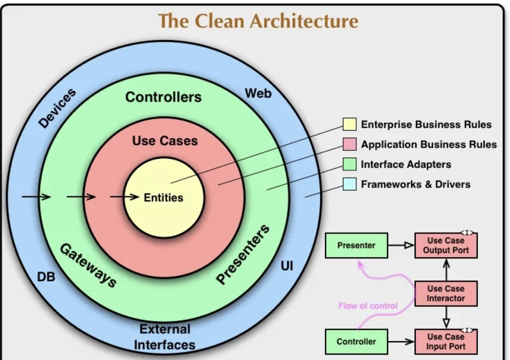
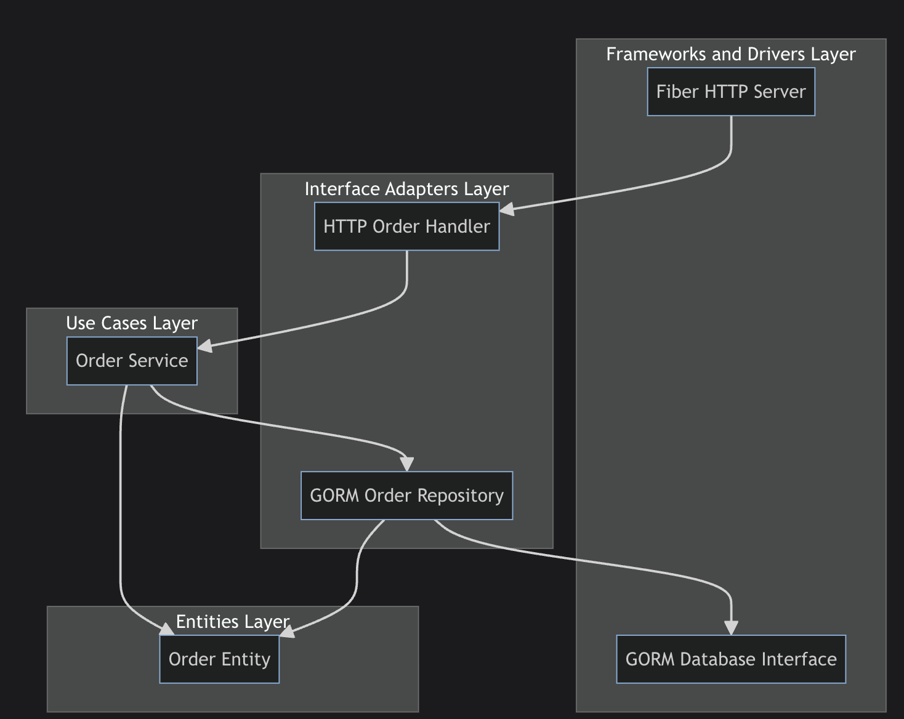
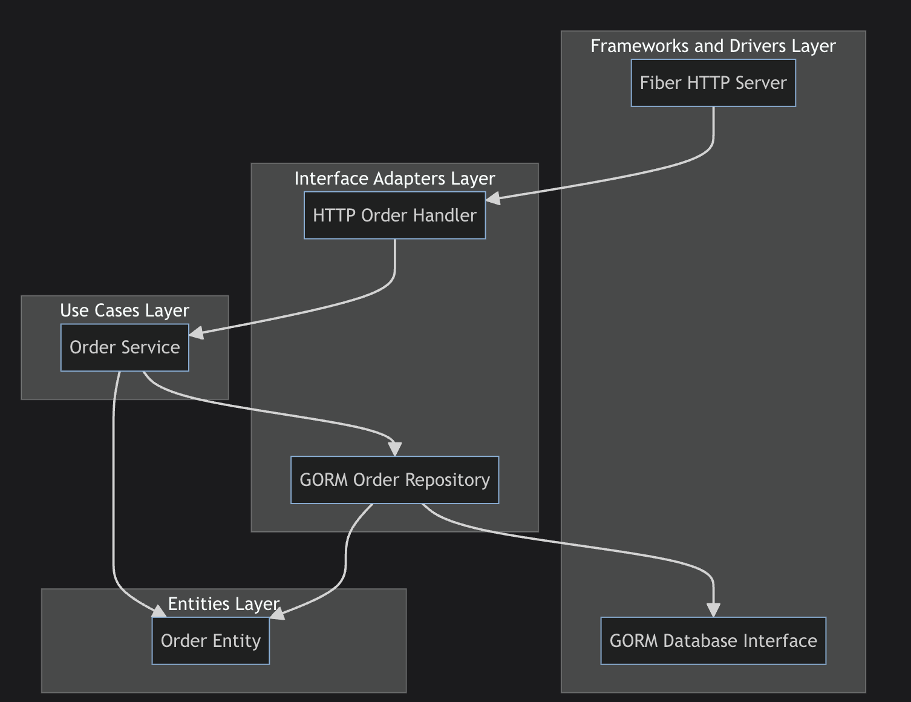

# Clean Architecture

Ref: https://blog.cleancoder.com/uncle-bob/2012/08/13/the-clean-architecture.html

โดย Clean Architecture นั้นมีการแบ่งองค์ประกอบใหญ่ๆออกเป็น 4 ชั้น (เหมือนวงกลม 4 วงที่ซ้อนกันตามภาพด้านบน) โดยพยายามมองจากส่วนที่ลึกที่สุด (ส่วนที่เป็นการจัดการข้อมูลสำคัญ) ไปจนถึงส่วนข้างนอกที่สุด (ส่วนที่มีการพูดคุยกับ user) คือ Entities, Use Cases, Interface Adapters และ Frameworks & Drivers โดยทั้ง 4 ชั้นมีหน้าที่ดังนี้

    - Entities คือการกำกับสิ่งที่เรียกว่า "business object" เอาไว้ โดยมีหน้าที่ใหญ่ๆในการกำหนด "โครงสร้างข้อมูล" โดยจะเป็นการกำหนดกฎของภาพใหญ่ไว้ว่า application นี้ต้องทำอะไรได้บ้างและมีข้อมูลที่เก็บลักษณะไหนบ้าง
ซึ่งจริงๆใน Layer นี้จะรวมถึงการจัดการกับ Database ด้วย หลายๆแหล่งจะเรียกว่า Repository
ดังนั้น Entities จึงเป็นการพูดถึงโครงสร้างข้อมูลและการจัดการข้อมูลนั่นเอง
Use Cases ประกอบด้วย application specific business rule ที่ทำการประกอบ business logic เอาไว้ เป็นเหมือน use case การใช้งานของระบบว่าระบบสามารถใช้งานอะไรได้บ้าง

    - Interface Adapters เป็นส่วนสำหรับการแปลงข้อมูลจาก format ที่รับเข้ามา ให้เป็น format ที่สามารถนำไปใช้ใน use case และ entities ต่อได้

เป็นส่วนที่เหมือนสะพานระหว่าง ส่วนที่อยู่ภายใน (Entities, Use cases) กับ ภายนอก (Framework & Driver หรือ external interface อย่าง database, Web API)
layer นี้เป็นส่วนที่รับต่อมาและทำการจัดการข้อมูลให้ถูกต้องก่อนจะนำไปใช้งานต่อ (คล้ายๆกับ Adapter ของ Hexagonal Architecture)
    - Frameworks and Drivers. เป็นส่วนที่อยู่นอกสุดซึ่งก็คือส่วนที่มีการเชื่อมต่อกับฝั่งผู้ใช้ และ service ภายนอกเช่น Database, Web framework
ใน layer นี้จะมีเพียงการเรียกใช้อย่างเดียว จะมี code ไม่เยอะมาก เปรียบเสมือนการประสานทุกส่วนเข้าด้วยกันเพื่อให้สามารถคุยกันภายในวงกลมทั่วทั้งวงได้ (ส่งข้อมูลต่อไปหากันได้)

จาก Diagram นี้ เราจะเทียบหน้าที่ออกเป็น

- Entities คือส่วนของ Order Entity ที่เป็นการประกาศโครงสร้างของข้อมูล Order เอาไว้ ว่าข้อมูล Order มีลักษณะเป็นอย่างไร
- Use case คือส่วนของการใช้งาน ซึ่งในที่นี่คือ function createOrder สำหรับการสร้าง Order ซึ่งจะเก็บเอาไว้ใน Order Service
โดย Order Service นั้นก็จะอ้างอิงโครงสร้างของ Order ตาม Order Entity ที่อยู่ใน layer ด้านในสุดอีกที
- Interface Adapters คือส่วนของการแปลงข้อมูลเพื่อทำการส่งไปยัง Use case เพื่อให้ Use case สามารถจัดการต่อได้ถูกได้จะมีทั้งหมด 2 ส่วนคือ
- GORM Order Repository คือส่วนที่จะทำการสร้าง function สำหรับจัดการ database และคำสั่งเกี่ยวกับการ query database (เพื่อทำการส่งคำสั่ง query นี้ไปยัง Order Service เพื่อให้ Order Service สามารถนำคำสั่งนี้ไปสร้าง Order ต่อได้ภายใน logic ของ use case ตัวเอง)
- HTTP Order Handler คือส่วนที่จะทำการสร้าง function สำหรับจัดการ data ที่ผ่านเข้ามาทาง HTTP Request ทำการแปลงให้ถูกต้องเพื่อทำการส่งข้อมูลให้ Order Service ให้เป็นไปตาม structure ของ Order ได้ถูกต้อง (ทำหน้าที่เหมือนตัวแปลงข้อมูลจากภายนอกให้ตรงตาม use case)
- Frameworks and Drivers Layer คือส่วนของการเชื่อมต่อกับ Application ภายนอกโดย
- Fiber HTTP Server คือ HTTP Server ที่ทำการสร้าง API เพื่อรับ request จากฝั่ง user เข้ามา เพื่อส่งต่อไปยัง Interface ของ HTTP
- GORM Database Interface คือส่วนของ Config database ที่ทำการเชื่อมกับ database เพื่อส่งต่อไปยัง Interface ของ Gorm

.
├── adapters --> ส่วนของ adapter
│   ├── gorm_order_repository.go
│   └── http_order_handler.go
├── entities --> ส่วนของ entities
│   └── order.go
├── main.go --> เป็นตัวหลักที่เชื่อมทั้งหมดเข้าด้วยกัน
└── usecases --> ส่วนของ use case
    ├── order_repository.go
    └── order_use_case.go